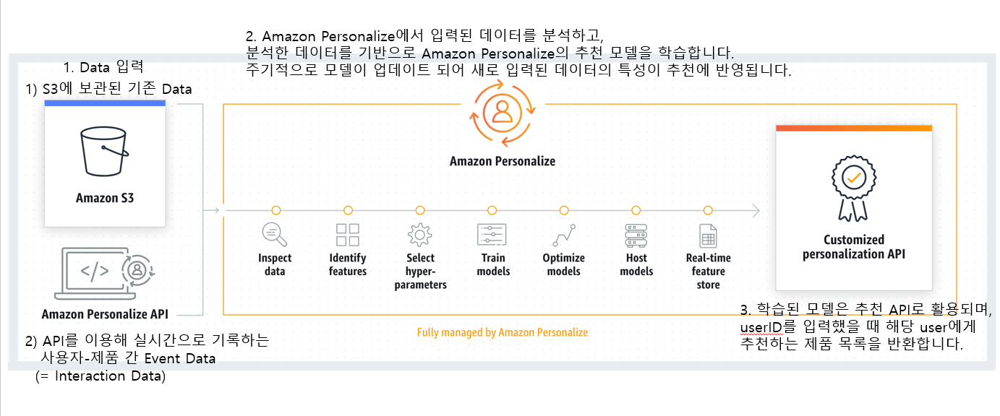

# AmazonPersonalize_Input_W5

### What

---

- Amazon Personalize를 이용한 실시간 사용자 추천 시스템을 사용합니다
- 이번 리서치는 Amazon Personalize 활용을 위해 필요한 input data에 대해 다룹니다
- Amazon Personalize의 추천 기법으로 User-Personalize recipe를 사용할 예정이며, 이에 관한 구체적인 내용은 W6 미팅에서 다루겠습니다.

### Why

---

- 나와 비슷한 체형의 사용자가 구매한 제품을 추천하기에 더 다양한 쇼핑이 가능합니다
- 나의 구매 이력, 기타 정보 등을 바탕으로 단번에 마음에 드는 상품들을 나열할 수 있습니다. (선호 가격대, 디자인 등등)

### How (Plans)

---

**<초기 INPUT DATA> : csv 파일**

(한 column의 값으로 여러 값을 표현해야 할 때, '|'로 구분합니다. (ex. pink | yellow))

[User & Item Interaction Data](https://www.notion.so/0ce53111474d4617a8e977d5d0a5167b)

사용자와 제품 간의 상호작용을 기록한 데이터입니다.

- TIMESTAMP (long): Unix epoch time format(1970년 1월 1일 00:00:00로부터 경과한 초)으로 기록되어야 합니다. (ex. Thursday, July 1, 2021 7:04:30 PM → 1625133870)
- EVENT_TYPE (string): user가 item에 대해 취한 행동을 나타냅니다. (ex. 'click', 'purchase', etc)
- EVENT_VALUE (float, null): 해당 EVENT_TYPE의 구체적인 수치를 나타냅니다.  별다른 수치로 표현할 수 없다면 빈칸으로 남겨둡니다. (ex. purchase한 제품의  가격: 15.9 천원, etc)
- DEVICE (string): user가 사용한 기기의 종류를 나타냅니다. mobile, pc, tablet 의 환경 차이가 행동 패턴에 변화를 준다면 추천에 영향을 줍니다. (ex. 'mobile', 'pc', 'tablet', etc)
- 또 어떤 정보를 사용할 수 있을까요??
- interaction_schema.json
    
    ```json
    {
      "type": "record",
      "name": "Interactions",
      "namespace": "com.amazonaws.personalize.schema",
      "fields": [
        {
          "name": "USER_ID",
          "type": "string"
        },
        {
          "name": "ITEM_ID",
          "type": "string"
        },
        {
          "name": "TIMESTAMP",
          "type": "long"
        },
        {
          "name": "EVENT_TYPE",
          "type": "string"
        },
        {
          "name": "EVENT_VALUE",
          "type": [
            "float",
            "null"
          ]
        },
        {
          "name": "DEVICE",
          "type": [
            "string",
            "null"
          ],
          "categorical": true
        }
      ],
      "version": "1.0"
    }
    ```
    

[User Data](https://www.notion.so/86d1729e12dd40b694c040814bdd14dd)

사용자의 정보를 기록한 데이터입니다.

- 2개 이상의 interaction을 가진 사용자 정보가 25명 이상 필요합니다.
- USER_ID를 제외한 부수적인 column, 즉 metadata는 최대 5개까지 기록할 수 있습니다.
- user_schema.json
    
    ```json
    {
      "type": "record",
      "name": "Users",
      "namespace": "com.amazonaws.personalize.schema",
      "fields": [
        {
          "name": "USER_ID",
          "type": "string"
        },
        {
          "name": "AGE",
          "type": "int"
        },
        {
          "name": "CUP_SIZE",
          "type": "string",
          "categorical": true
        },
        {
          "name": "BAND_SIZE",
          "type": "int",
          "categorical": true
        }
      ],
      "version": "1.0"
    }
    ```
    

[Item Data](https://www.notion.so/120d6f3f44084befa82fe5c4c9f14264)

- CREATION_TIMESTAMP:
    
    제조일자를 나타냅니다. 입력하지 않을 경우 제품의 첫 번째 interaction data에서의 TIMESTAMP를 자동으로 기입합니다. 풀라 사이트에 item을 입력한 시간을 제조일자 대신 입력할 수도 있습니다. 이 정보는 새로 유입된 제품을 더 많이 노출 시키고자 할 때 사용됩니다.
    
- item_schema.json
    
    ```json
    {
      "type": "record",
      "name": "Items",
      "namespace": "com.amazonaws.personalize.schema",
      "fields": [
        {
          "name": "ITEM_ID",
          "type": "string"
        },
        {
          "name": "CREATION_TIMESTAMP",
          "type": "long"
        },
        {
          "name": "CUP_SIZE",
          "type": [
            "string",
            "null"
          ],
          "categorical": true
        },
        {
          "name": "BAND_SIZE",
          "type": [
            "string",
            "null"
          ],
          "categorical": true
        },
        {
          "name": "WIRE",
          "type": "boolean"
        },
        {
          "name": "BRARET",
          "type": "boolean"
        },
        {
          "name": "CUP_TYPE",
          "type": "string",
          "categorical": true
        },
        {
          "name": "GORE_HEIGHT",
          "type": "string",
          "categorical": true
        },
        {
          "name": "GORE_WIDTH",
          "type": [
            "string",
            "null"
          ],
          "categorical": true
        },
        {
          "name": "BRARET_LINE",
          "type": [
            "string",
            "null"
          ],
          "categorical": true
        },
    	{
    		"name": "BSW",
    		}
      ],
      "version": "1.0"
    }
    ```
    
- unstructed text metadata: 제품명, 리뷰 등을 item data의 column으로 추가할 수 있습니다. 하지만 Amazon Personalize는 영어만 인식하기 때문에 풀라에서는 적합하지 않습니다.

**<실시간 INPUT DATA>**

- **로그인 하기 전의 사용자 정보: sessionID**
    
    사용자가 초기에 사이트를 진입하여 UUID(universally unique identifier) 값을 가지는 sessionID가 형성되면 해당 sessionID의 interaction data가 기록됩니다. 로그인 이후에는 sessionID가 userID와 연결되어 연속적인 interaction data가 형성되고, 함께 추천에 사용됩니다.
    

<추천 flow 간단 설명>



- 추천 모델을 학습하는 것의 의미
    
    [User-Item 평점 matrix](https://www.notion.so/2496a2e26d094396a1beb9dd83f5b681)
    
    사용자 A와 사용자 B가 제품 1, 2에 준 평점을 준 패턴을 분석했을 때, 사용자 행동 패턴이 비슷하므로 A와 B는 비슷한 사용자입니다. 이 때 사용자 B는 A와 마찬가지로 제품 3에게 낮은 평점을 줄 것이라 예측할 수 있습니다. 이처럼 나와 비슷한 사용자가 반응했던 제품을 나에게도 추천하는 방식이 사용자 협업 필터링의 원리입니다.
    
    추천 모델은 각 사용자의 각 제품에 대한 반응을 예측하고, 학습을 통해 모델이 예측한 값과 기존 입력 데이터(빈칸이 아닌 값)의 오차를 최소화 해 나갑니다. 이때 user-item event를 기록한 interaction data 뿐만 아니라 사용자 및 제품에 대한 부수적인 정보, 즉, user data와 item data를 이용해 더 구체적인 학습 및 추천이 가능하게 합니다.
    

### Reference

---

- Data 종류: Interaction, User, Item

[Datasets and schemas](https://docs.aws.amazon.com/personalize/latest/dg/how-it-works-dataset-schema.html)

- Data format

[Formatting your input data](https://docs.aws.amazon.com/personalize/latest/dg/data-prep-formatting.html)

- 실시간 interaction data 기록

[Recording events](https://docs.aws.amazon.com/personalize/latest/dg/recording-events.html)